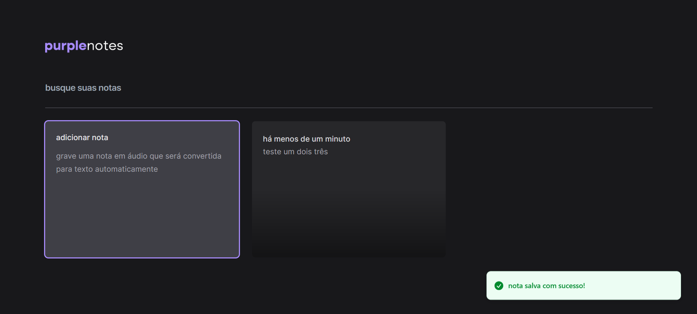

# PurpleNotes 

Aplicação desenvolvida durante o Next Level Week da Rocketseat, utilizando React, Typescript, Tailwind e a API SpeechRecognition.

## Descrição

O PurpleNotes é uma plataforma de notas onde os usuários podem adicionar notas por meio de áudio, que são automaticamente convertidas em texto usando a API SpeechRecognition. A aplicação oferece uma interface amigável e responsiva, permitindo aos usuários organizar e acessar suas notas de maneira eficiente.

## Recursos

- Adição de notas por texto ou gravação de áudio.
- Conversão automática de áudio para texto usando a API SpeechRecognition.
- Armazenamento local das notas utilizando o localStorage.
- Busca rápida e fácil de notas.

## Tecnologias Utilizadas

- React
- Typescript
- Tailwind CSS
- API SpeechRecognition

## Instalação

1. Clone o repositório: `git clone https://github.com/seu-usuario/purplenotes.git`
2. Instale as dependências: `npm install`
3. Inicie a aplicação: `npm start`

Certifique-se de ter o Node.js e o npm instalados no seu sistema.

